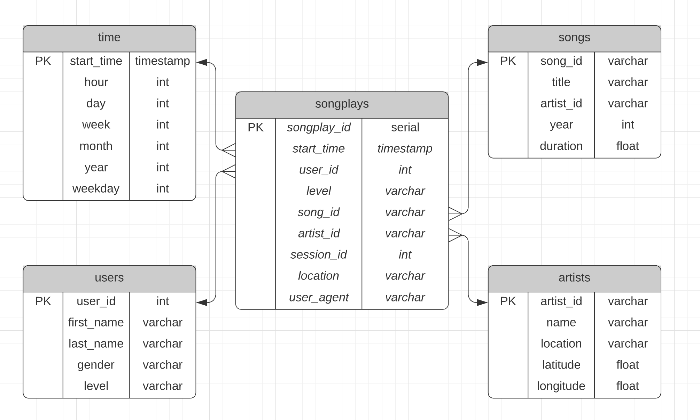

# Sparkify Database 
## Introduction
The Sparkify startup offers a music streaming app which allows users to listen to music online. 

Sparkify collects log data for user interactions with their app. 
This includes session information such as: 
- what songs and artists users listened to 
- how long users spent listening to music using the app

Sparkify has additional metadata about songs and artists. 

## Purpose
This PostgreSQL database was setup to provide insight into what songs and artists are popular with their users. 

This information could help inform:
- music recommendations - what music should Sparkify reccommend to their users 
- future music acquisition - what artists should Sparkify prioritize for future music acquisition
- free and paid music offering - can Sparkify improve on their subscription tiers (free vs paid offering) based on what users are listening to

## Database Schema
This database was setup from the "log_data" files, which contain information about user interaction with Sparkify, as well as the "song_data" files which contain metadata about the artists and songs available in Sparkify.  

This database consists of one fact table, "songplays" and 4 dimension tables: 
- time
- users
- artists
- songs

This database is setup as using a simple star schema to optimise for simplified queries and fast aggregations of data. In order to optimise for writes to the tables in this schema, foreign keys were not enforced, however, you can see the relationships between the tables in the star schema in the Sparkify ERDS diagram below: 



## Sample SQL Queries: 
The "songplays" table contains many records with NULL song_id and artist_id columns. 
This means that we cannot perform all the queries on this db until more song and artist metadata is uploaded. 
Some example SQL queries are shown to answer some of the questions that Sparkify might have about their users: 

1. What songs are most popular with free users? 
Return the top 5 song titles for free users. 
``` sql
SELECT
    s.title,
    COUNT(sp.*) as listened_count
FROM
    songplays sp 
INNER JOIN songs s ON
    s.song_id =sp.song_id 
WHERE 
    sp.level = 'free'
GROUP BY 
    s.title
ORDER BY 
    listened_count DESC
LIMIT 5;
;
```

2. What is the average number of songs listened to by users in a session. 
To answer this question, we will count the songs per session_id and average this across all sessions. 
``` sql 
with songs_per_session AS (
    SELECT 
        COUNT(*) AS songs_per_session, 
        session_id 
    FROM 
        songplays 
    GROUP BY 
        session_id) 
    SELECT 
        ROUND(avg(songs),1) as average_num_songs 
    FROM 
        songs_per_session
```
3. Does this app appeal more to male or female listeners? 
To answer this question lets look at how many users we have, split by gender and then calculate what percentage of the total users per gender are paid users. 
``` sql 
with total_users AS ( 
    select 
        count(*) as total_users, 
    gender 
    from 
        users 
    group by 
    gender) 
, paid_users AS ( 
    select 
        count(*) as paid_users, 
        gender, 
        level 
    from 
        users 
    where 
        level ='paid' 
    group by 
        gender, 
        level) 
select 
    tu.gender, 
    tu.total_users, 
    pu.paid_users, 
    ROUND(CAST(pu.paid_users AS numeric) /CAST(tu.total_users AS numeric)*100,1) as percentage_paid_users  
from 
    total_users tu 
inner join 
    paid_users pu on 
        tu.gender = pu.gender 
```


